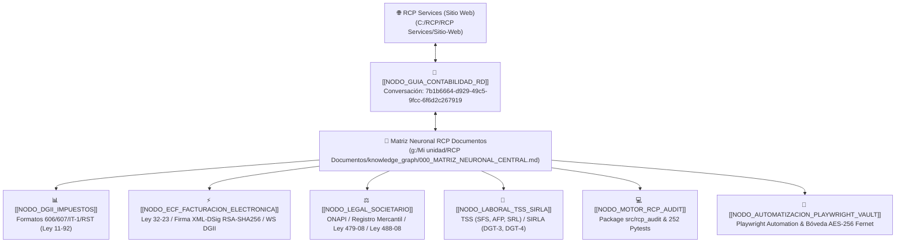

# 🌉 Enlace Neuronal: Guía Profesional Contabilidad RD ↔ RCP Services

Este nodo conecta el proyecto **RCP Services (Sitio Web & Tienda)** con el módulo y la conversación **"Guía Profesional Contabilidad RD"** (`7b1b6664-d929-49c5-9fcc-6f6d2c267919`), ubicada en el espacio de trabajo **RCP Documentos** (`g:/Mi unidad/RCP Documentos`).

---

## 🗺️ Mapa del Grafo de Conocimiento Interconectado

---

## 📍 Ubicación e Índice del Conocimiento

1. **Conversación de Origen**:
   - **ID**: `7b1b6664-d929-49c5-9fcc-6f6d2c267919`
   - **Título**: `Guía Profesional Contabilidad RD`
   - **Transcript**: [transcript.jsonl](file:///C:/Users/balmi/.gemini/antigravity/brain/7b1b6664-d929-49c5-9fcc-6f6d2c267919/.system_generated/logs/transcript.jsonl)

2. **Matriz Neuronal de Conocimiento (Obsidian MOC)**:
   - **Archivo**: [000_MATRIZ_NEURONAL_CENTRAL.md](file:///g:/Mi%20unidad/RCP%20Documentos/knowledge_graph/000_MATRIZ_NEURONAL_CENTRAL.md)
   - **Índice JSON**: [graphify_index.json](file:///g:/Mi%20unidad/RCP%20Documentos/knowledge_graph/graphify_index.json)

3. **Motor Python & Bóveda Cifrada**:
   - **Paquete**: [src/rcp_audit](file:///g:/Mi%20unidad/RCP%20Documentos/src/rcp_audit)
   - **Bóveda AES-256**: [vault.py](file:///g:/Mi%20unidad/RCP%20Documentos/src/rcp_audit/security/vault.py)
   - **Automatización Playwright**: [dgii_ofv.py](file:///g:/Mi%20unidad/RCP%20Documentos/src/rcp_audit/automation/dgii_ofv.py) y [tss_onapi.py](file:///g:/Mi%20unidad/RCP%20Documentos/src/rcp_audit/automation/tss_onapi.py)
   - **Backend Server**: [server.py](file:///g:/Mi%20unidad/RCP%20Documentos/server.py) (Puerto 8000)

---

## 🏷️ Grafo de Etiquetas Compartidas
- `#capa-neuronal/bridge`
- `#graphify/contabilidad-rd`
- `#dgii/ley11-92`
- `#facturacion-electronica/ley32-23`
- `#rcp-services/integracion`
